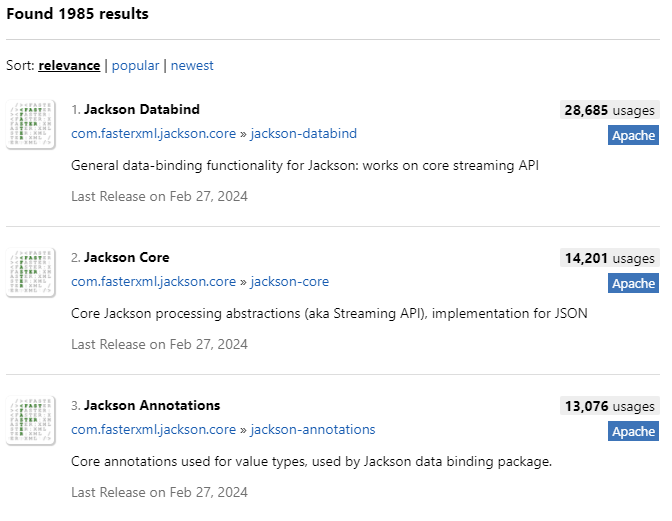
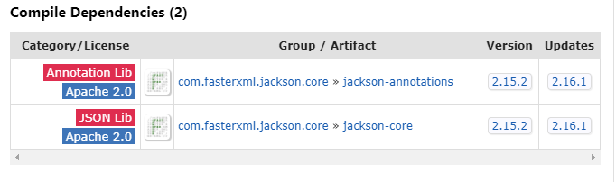
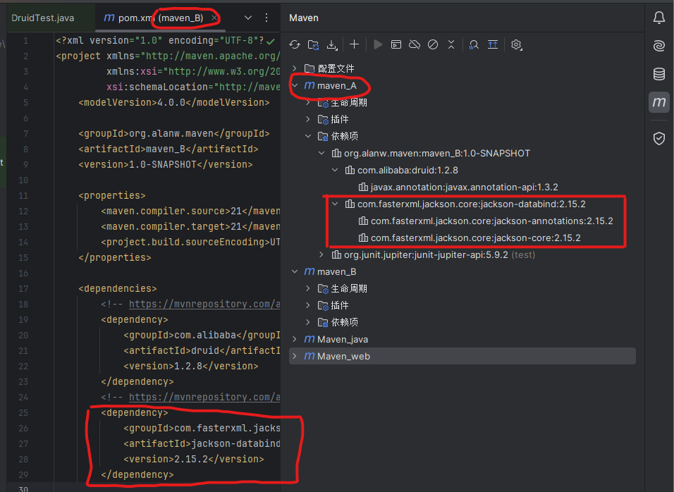
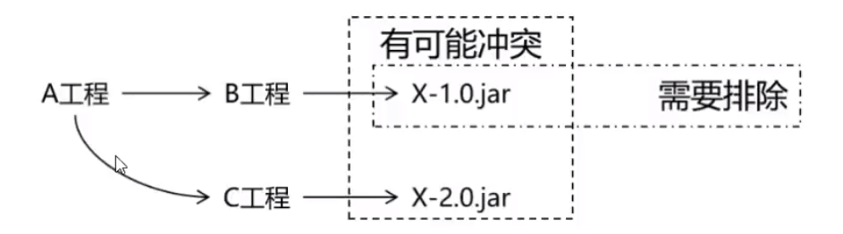

# Maven依赖管理、项目构建工具

## 一、Maven依赖传递特性

### （一）概念

假设有Maven项目A，项目B依赖A，项目C依赖B。那么我们可以说C依赖A。也就是说，依赖关系为：C—>B—>A；那么我们执行项目C时，会自动把A、B都下载导入到C项目的jar包目录中，这就是依赖的**传递性**

* 案例：导入jackson依赖；分析：jackson需要三个依赖
  
* 依赖传递关系：databind依赖另外两个依赖
  
* 最佳导入方式：只需要导入databind，可以自动传递另外两个依赖（下图中maven_A依赖maven_B）
  

* **传递的作用**

  * 简化依赖导入过程
  * 确保依赖版本正确
* **传递的原则**

  * 在A依赖B，B依赖C的前提下（A—>B—>C），C是否能够传递到A，取决于B依赖C时使用的依赖范围以及配置
    * B依赖C时使用**compile范围**：可以传递
    * B依赖C时使用**test**或**provided范围**：不能传递，所以需要这样的jar包时，就必须在需要的地方明确配置依赖才可以
    * B依赖C时，若配置了以下标签，则不能传递（**optional标签**可以终止依赖传递）

  ```xml
  <dependency>
      <groupId>com.alibaba</groupId>
      <artifactId>druid</artifactId>
      <version>1.2.8</version>
      <!--有此标签时不可传递-->
      <optional>true</optional>
  </dependency>
  ```

### （二）依赖传递终止

* 非compile范围进行依赖传递
* 使用optional配置终止传递
* 依赖冲突（传递的依赖已经存在）

### （三）依赖冲突

#### 1、依赖冲突特性

* 当一个项目直接或者间接引用（依赖传递）出现了相同的jar包，这时项目会出现jar包重复，这就是 **“冲突”**！依赖冲突避免出现重复依赖，并且终止依赖传递！
  
* maven有自动解决依赖冲突问题的能力，会按照自己的原则，进行重复依赖选择。同时也提供了手动解决冲突的方法（不过不推荐手动解决）

#### 2、解决依赖冲突（如何选择重复依赖）方式

1. 自动选择原则

   * 短路优先原则
     * A——>B——>C——>D——>E——>X(version 0.0.1)
     * A——>F——>X(version 0.0.2)
     * 则A依赖于X（version 0.0.2）
   * 依赖路径长度相同的情况下，则“先声明优先”（第二原则）
     * A——>E——>X(version 0.0.1)
     * A——>F——>X(version 0.0.2)
     * 在A的\<dependies></dependies>中先声明的依赖，如果路径长度相同会优先选择（如：先声明E再声明F，会优先使用E中的version 0.0.1）！
2. 手动排除

   * 在对应依赖的\<dependency>标签中使用\<exclusions>标签排除依赖

   ```xml
   <!--排除了druid依赖-->
   <dependencies>
        <dependency>
            <g..>中间依赖...</g>
            <a..>...</a>
            <v..>...</v>
            <!--依赖排除-->
            <exclusions>
                <exclusion>
                    <grounpId>com.alibaba</grounpId>
                    <artifactId>druid</artifactId>
                </exclusion>
            </exclusions>
        </dependecy>
    </dependencies>
   ```

## 二、Maven工程继承和聚合关系

### （一）Maven工程继承关系

#### 1、继承概念

Maven继承是指在Maven的项目中，让一个项目从另一个项目中继承配置信息的机制。继承可以让我们在多个项目中共享同一配置信息，简化项目的管理和维护工作

#### 2、继承作用

在父工程中统一管理项目中的依赖信息，可以将一个大型项目分为父工程和子工程,其中父工程的唯一作用就是定义所有子模块工程的资源版本（父工程不编写代码，只编辑pom.xml文件）

* 它的背景是：
  * 对一个比较大的项目进行了模块拆分
  * 一个project下面，创建了很多个module
  * 每一个module都需要配置自己的依赖信息
* 它背后的需求：
  * 在每一个module中各自维护各自的依赖信息很容易发生出入，不易统一管理
  * 使用同一个框架内的不同jar包，它们应该是同一个版本，所以整个项目中使用的框架版本需要统一
  * 使用框架时所需要的jar包组合（或者说是依赖组合）需要经过长期摸索和反复调试，最终确定一个可用组合。这个耗费很大经历总结出来的方案不应该在新的项目中重新摸索
  * 通过在父工程中为整个项目维护依赖信息的组合既保证了整个项目使用规范、准确的jar包；又能够将以往的经验沉淀下来，节约时间和经历

#### 3、继承语法

Tip：**【子工程需要创建在父工程目录下】**，父工程不需要编写代码，所以可以删除父工程的src文件，只保留pom.xml文件

* 父工程

  ```xml
  <groupId>org.alanw.maven</groupId>
  <artifactId>maven_parent</artifactId>
  <version>1.0-SNAPSHOT</version>
  <!--由于父工程不需要参与打包，因此打包方式为pom-->
  <packaging>pom</packaging>
  ```

* 子工程

  ```xml
  <!--父工程坐标-->
    <parent>
      <groupId>org.alanw.maven</groupId>
      <artifactId>maven_parent</artifactId>
      <version>1.0-SNAPSHOT</version>
    </parent>

    <!--只显示artifactId,因为groupId与version父工程一致时可以省略-->
    <artifactId>maven_son</artifactId>
  ```

#### 4、\<dependencyManagment>标签

父工程中，将\<dependencies>标签写入\<dependencyManagment>标签，子工程【不会直接继承】父工程的依赖，需要进行手动配置才能继承，这样可以对需要用到的依赖进行管理

```xml
<dependencyManagement>
    <dependencies>
        <!-- https://mvnrepository.com/artifact/com.alibaba/druid -->
        <dependency>
            <groupId>com.alibaba</groupId>
            <artifactId>druid</artifactId>
            <version>1.2.8</version>
        </dependency>
        <!-- https://mvnrepository.com/artifact/org.junit.jupiter/junit-jupiter-api -->
        <dependency>
            <groupId>org.junit.jupiter</groupId>
            <artifactId>junit-jupiter-api</artifactId>
            <version>5.9.2</version>
            <scope>test</scope>
        </dependency>
        <!-- https://mvnrepository.com/artifact/javax.servlet/javax.servlet-api -->
        <dependency>
            <groupId>javax.servlet</groupId>
            <artifactId>javax.servlet-api</artifactId>
            <version>3.1.0</version>
            <scope>provided</scope>
        </dependency>
    </dependencies>
</dependencyManagement>
```

子工程中需要继承父工程中的依赖（如servlet）时，需要进行以下配置

```xml
<dependencies>
    <!-- https://mvnrepository.com/artifact/javax.servlet/javax.servlet-api -->
    <dependency>
        <groupId>javax.servlet</groupId>
        <artifactId>javax.servlet-api</artifactId>
        <!--不需要配置版本号和依赖范围-->
    </dependency>
</dependencies>
```

### （二）Maven工程聚合关系

#### 1、聚合概念

Maven聚合是指将多个项目组织到一个父级目录中，以便一起构建和管理的机制。聚合可以帮助我们更好地管理一组相关的子项目，同时简化它们的构建和部署过程

#### 2、聚合作用

* 管理多个子项目：通过聚合，可以将多个子项目组织在一起，方便管理和维护
* 构建和发布一组相关的项目：通过聚合，可以在一个命令中构建和发布多个相关的项目，简化了部署和维护工作
* 优化构建顺序：通过聚合，可以对多个项目进行顺序控制，避免出现构建依赖混乱导致构建失败的情况
* 统一管理依赖项：通过聚合，可以在父项目中管理公共依赖和插件，避免重复定义

#### 3、聚合语法

* 父项目中包含子项目列表，当父工程进行测试、打包等生命周期时，子工程列表中的子工程也会一并执行

  ```xml
  <groupId>org.alanw.maven</groupId>
  <artifactId>maven_parent</artifactId>
  <version>1.0-SNAPSHOT</version>
  <!--由于父工程不需要参与打包，因此打包方式为pom-->
  <packaging>pom</packaging>

  <!--子项目列表-->
  <modules>
    <module>maven_son</module>
    <module>.../...子工程路径</module>
  </modules>

  ```
