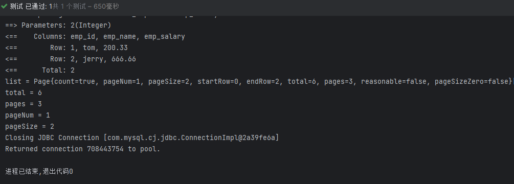

# MyBatis扩展&总结

## 一、Mapper按包批量扫描

mybatis_config.xml配置批量包扫描：扫描包下的所有MapperXML文件

```xml
<mappers>
    <!--批量mapper指定
        1.要求MapperXML文件和Mapper接口的命名相同
        2.要求最终打包后的位置一致 都是指定的包地址
            方案一：XML文件也加入到接口所在的包即可
                    （不推荐，需要在maven配置文件pom中添加额外配置才能将MapperXML打包）
            方案二：resource文件夹下创建对应的文件夹结构即可

        注意：在resources下直接创建多层文件夹 使用“/”分隔，使用“.”分隔就是一层文件夹
    -->
    <package name="org.alan.mapper"/>
</mappers>
```

## 二、插件和分页插件PageHelper

### 2.1 插件机制和PageHelper插件介绍

**待补充...**

### 2.2 PageHelper插件使用

1. pom.xml引入依赖

    ```xml
    <dependency>
        <groupId>com.github.pagehelper</groupId>
        <artifactId>pagehelper</artifactId>
        <version>6.1.0</version>
    </dependency>
    ```

2. mybatis_config.xml配置分页插件

    在MyBatis的配置文件中添加PageHelper的插件：

    ```xml
    <plugins>
        <plugin interceptor="com.github.pagehelper.PageInterceptor">
            <property name="helperDialect" value="mysql"/>
        </plugin>
    </plugins>
    ```

    其中，com.github.pagehelper.PageInterceptor是PageHelper插件的名称，dialect属性用于指定数据库类型（支持多种数据库）

3. 页插件使用

    在查询方法中使用分页：

    ```java
    public class MybatisTest {
        private SqlSession sqlSession;

        @BeforeEach
        public void init() throws IOException {
            sqlSession = new SqlSessionFactoryBuilder()
                    .build(Resources.getResourceAsStream("mybatis_config.xml"))
                    .openSession(true);
        }

        @Test
        public void test_01(){
            EmployeeMapper mapper = sqlSession.getMapper(EmployeeMapper.class);

            //在调用之前先设置分页的数据（当前是第几页，每页显示多少个）
            PageHelper.startPage(1,2);
            //TODO：注意，只能装一个查询语句
            List<Employee> employees = mapper.queryList();//查询语句
            //将查询数据封装到一个PageInfo的分页实体类中（一共有多少页，一共有多少条等等）
            PageInfo<Employee> pageInfo = new PageInfo<>(employees);


            //pageInfo获取分页的数据
            //当前页的数据
            List<Employee> list = pageInfo.getList();
            System.out.println("list = " + list);
            //获取的总条数
            long total = pageInfo.getTotal();
            System.out.println("total = " + total);
            //获取总页数
            int pages = pageInfo.getPages();
            System.out.println("pages = " + pages);
            //...
            int pageNum = pageInfo.getPageNum();
            System.out.println("pageNum = " + pageNum);
            int pageSize = pageInfo.getPageSize();
            System.out.println("pageSize = " + pageSize);
            //...
        }

        @AfterEach
        public void clean(){
            sqlSession.close();
        }
    }
    ```

    测试结果：

      

## 三、逆向工程和MyBatisX插件*

详情参考：<https://www.bilibili.com/video/BV1AP411s7D7?p=98>，理解什么是“ORM逆向思维”、“逆向工程”

使用IDEA的【**MyBatisX插件**】，根据数据表结构一键生成【单表】增、删、改操作的MapperXML操作，及其实体类、Mapper方法接口。

## 四、MyBatis总结

|核心点|掌握目标|
|-|-|
|MyBatis基础|使用流程，参数插入，#{}${}，参数输出|
|MyBatis多表|实体类设计，resultMap多表结果映射|
|MyBatis动态语句|MyBatis动态语句概念，where，if，foreach标签|
|MyBatis|Mapper批量处理，分页插件，逆向工程|
