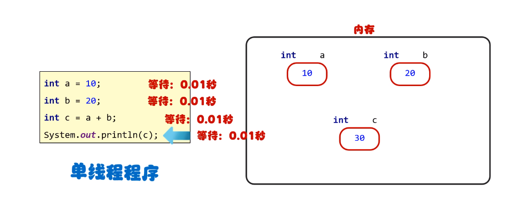
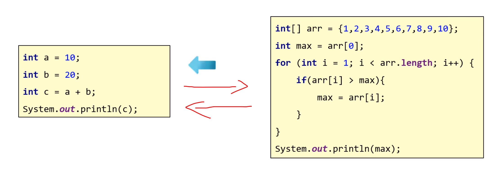
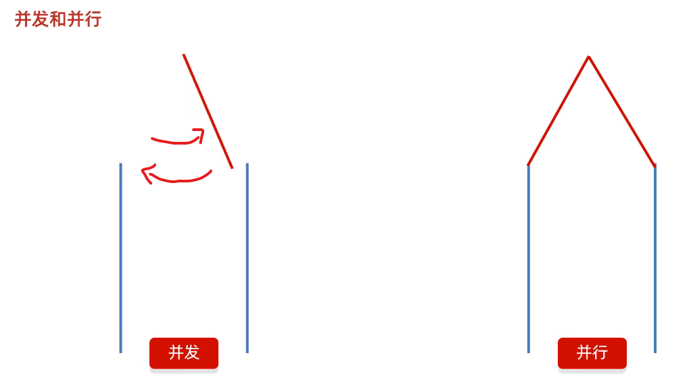

# 多线程

## 一、什么是线程（Thread）

* 线程（Thread）：线程是操作系统能够进行运算调度的最小单位。它被包含在【进程】之中，是进程中的实际运作单位
  简单理解：应用软件中互相独立，可以同时运行的功能
* 进程（Process）： 进程是程序的基本执行实体

### （一）单线程

* 单线程工作机制：代码从上至下顺序执行



### （二）多线程

* 多线程：CPU线程可在不同程序间互相切换

  
* 多线程应用场景：软件中的耗时操作，如拷贝迁移大文件、加载大量资源文件（游戏加载）；聊天软件和后台服务器
* 多线程的作用：使程序可以同时执行多个在【时间维度】上并不冲突的任务，提高程序运行效率

#### 1.并发和并行

* 并发：在同一时刻，有多个指令在单个CPU上【交替】执行

  
* 并行：在同一时刻，有多个指令在多个CPU上【同时】执行

  

## 二、Java如何实现多线程

* 通过继承Thread类的方式实现
* 通过实现Runable接口的方式实现
* 利用Callable接口和RunnableFuture接口方式实现

### （一）继承Thread类

* 实现步骤

1. 创建子线程类（以下实例中命名为Zi_Thread），继承Thread类,，重写run方法（即子线程要执行的代码）

   ```java
   public class Zi_Thread extends Thread{
       @Override
       public void run() {
           //线程要执行的代码，例如
           for (int i = 0; i < 5; i++) {
               System.out.println(getName()+"子线程执行");
           }
       }
   }
   ```

2. 在Main类中创建子线程对象

   ```java
   Zi_Thread t1 = new Zi_Thread();
   ```

3. 调用子线程对象，执行Start方法（注意不能直接执行子线程类中重写的run方法，否则本质是简单调用了其它类中的方法，并没有实现多线程操作）

   ```java
   t1.start();
   ```

### （二）实现Runnable接口

* 实现步骤

1. 定义一个类实现Runnable接口，重写run方法

   ```java
   public class RunnableImpl implements Runnable{
       @Override
       public void run() {
           //线程要执行的代码，例如
           for (int i = 0; i < 10; i++) {
               //获取到当前线程的对象
   //            Thread t = Thread.currentThread();
               System.out.println(Thread.currentThread().getName()+":子线程执行");
           }
       }
   }
   ```

2. 在Main类中创建该实现类对象，仅表示子线程要执行的任务

   ```Java
   RunnableImpl ri = new RunnableImpl();
   ```

3. 创建子线程对象

   ```Java
    Thread t1 = new Thread(ri);
   ```

4. 开启线程

   ```Java
    t1.start();
   ```

### （三）利用Callable接口和RunnableFuture接口方法实现

* **此实现方式可返回多线程运行结果**

* 实现步骤

1. 创建一个类MyCallable实现Callable接口，重写call（是有返回值的，表示多线程运行的结果）

   ```Java
   public class MyCallable implements Callable<Integer> {
    @Override
    public Integer call() throws Exception {
        //求1~100的和
        int sum=0;
        for (int i = 1; i <= 100; i++) {
            sum=sum+i;
        }
        return sum;
      }
   }
   ```

2. 创建MyCallable的对象（表示多线程要执行的任务）

   ```Java
   MyCallable mc = new MyCallable();
   ```

3. 创建FutureTask的对象（作用管理多线程运行的结果），Tip：FutureTask类实现了RunnableFuture接口

   ```Java
   FutureTask<Integer> ft = new FutureTask<>(mc);
   ```

4. 创建Thread的对象（表示线程），启动线程

   ```Java
   //创建线程对象，启动线程
   Thread t1 = new Thread(ft);
   t1.start();
   ```

5. 获得执行结果并打印

   ```Java
   //获取多线程运行的结果
   Integer result = ft.get();
   System.out.println(result);
   ```

### （四）三种方式对比


