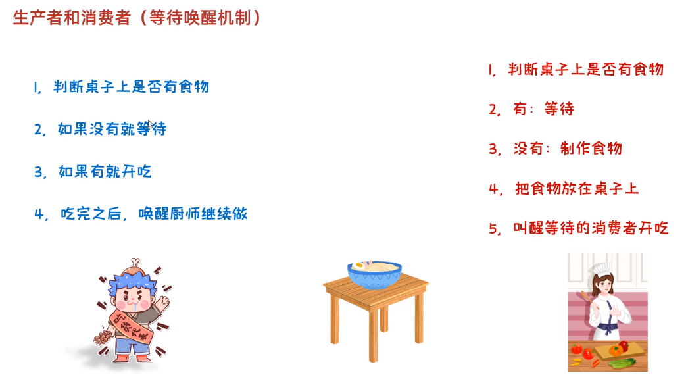
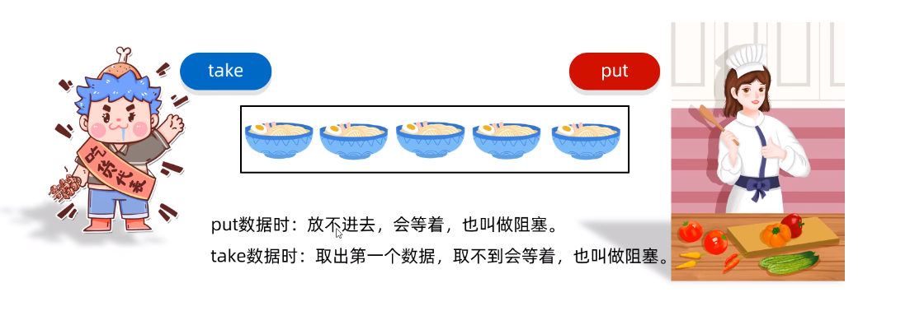
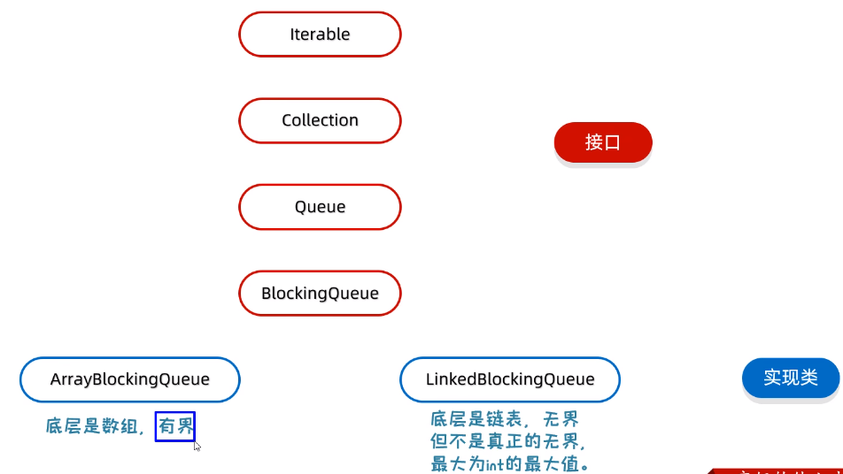
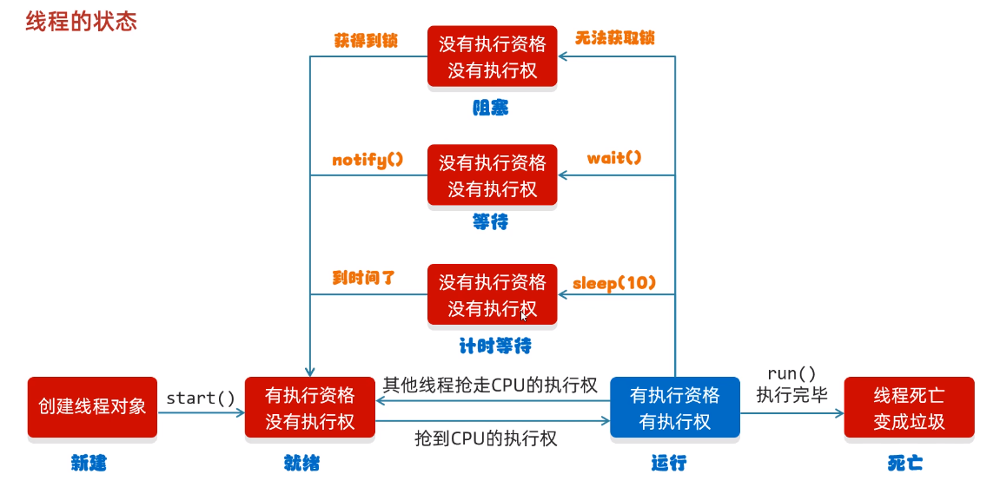
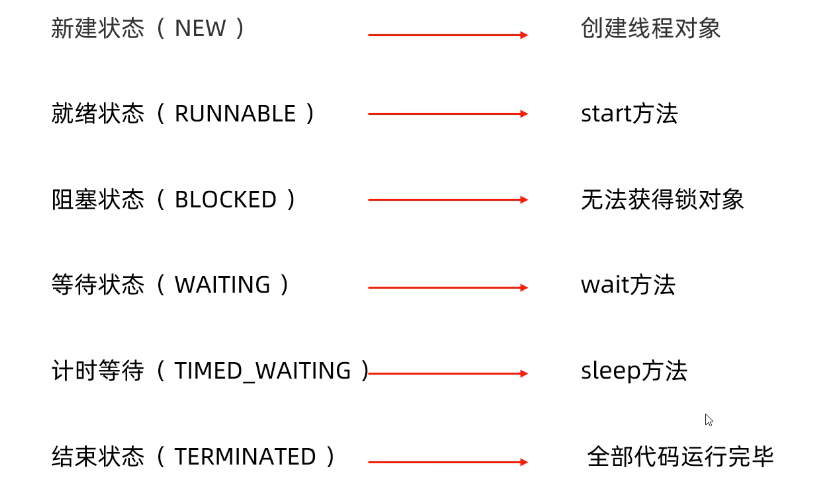

# Java-多线程

## 一、等待唤醒机制（生产者和消费者）

* 生产者消费者模式是一个十分经典的多线程协作的模式
* **【生产者】**：生产数据；**【消费者】**：处理数据
* 理想情况:生产者“生产”一次，消费者“消费”一次

### （一）一般方式

#### 1.一般方式执行思想

* 如图所示


#### 2.常见方法

| 方法             | 说明                             |
| ---------------- | -------------------------------- |
| void wait()      | 当前线程等待，直到被其它线程唤醒 |
| void notify()    | 随机唤醒单个线程                 |
| void notifyAll() | 唤醒所有线程                     |

#### 代码实现#1

* 以简单的”厨师-顾客“问题为例

##### 1.“桌子”代码实现 #1

```java
public class Desk {
    /**
     * 控制生产者和消费者的执行
     */

    //是否有面条 0：没有面条  1：有面条
    public static int foodFlag=0;

    //总个数
    public static int count = 10;

    //锁对象
    public static final Object lock = new Object();
}
```

##### 2.消费者（顾客）代码实现

```java
public class Consumer extends Thread{
    @Override
    public void run() {
        /**
         * 1.循环
         * 2.同步代码块
         * 3.判断共享数据是否到了末尾（到了）
         * 4.判断共享数据是否到了末尾（没到，执行核心逻辑）
         */

        while (true){
            synchronized (Desk.lock){
                if (Desk.count == 0){
                    break;
                }else {
                    //先判断桌子上是否有面条
                    if ( Desk.foodFlag== 0) {
                        //如果没有，就等待
                        try {
                            Desk.lock.wait();//使用锁对象调用wait()，让当前线和锁进行绑定
                        } catch (InterruptedException e) {
                            throw new RuntimeException(e);
                        }
                    }else {
                        //把吃的总数-1
                        Desk.count--;
                        //如果有，就开吃
                        System.out.println("吃货在吃面条，还能再吃"+Desk.count+"碗");
                        //吃完后，唤醒厨师继续做
                        Desk.lock.notifyAll();//唤醒这把锁绑定的线程
                        //修改桌子的状态
                        Desk.foodFlag = 0;
                    }
                }
            }
        }


    }
}
```

##### 3.生产者（厨师）代码实现

```java
public class Cook extends Thread{
    @Override
    public void run() {
        /**
         * 1.循环
         * 2.同步代码块
         * 3.判断共享数据是否到了末尾（到了）
         * 4.判断共享数据是否到了末尾（没到,执行核心逻辑）
         */

        while (true){
            synchronized (Desk.lock){
                if (Desk.count == 0) {
                    break;
                }else {
                    //判断桌子上是否有食物
                    if (Desk.foodFlag== 1) {
                        //如果有，就等待
                        try {
                            Desk.lock.wait();
                        } catch (InterruptedException e) {
                            throw new RuntimeException(e);
                        }
                    }else {
                        //若果没有，就制作食物
                        System.out.println("厨师做了一碗面条");
                        //修改桌子上的事物状态
                        Desk.foodFlag = 1;
                        //叫醒等待的消费者开吃
                        Desk.lock.notifyAll();
                    }

                }
            }
        }


    }
}
```

### （二）阻塞队列方式

#### 1.阻塞队列执行思想

* 如图所示

* 阻塞队列的继承结构


#### 代码实现#2

##### 1.“消费者”代码实现

```java
public class Consumer extends Thread{
    //创建阻塞队列成员变量
    ArrayBlockingQueue<String> queue;
    //在构造方法中传入阻塞队列
    public Consumer(ArrayBlockingQueue<String> queue) {
        this.queue = queue;
    }

    @Override
    public void run() {
        while (true){
            //不断从阻塞队列中获取面条
            try {
                String food=queue.take();//无需加锁，take方法中已加锁
                System.out.println(food);
            } catch (InterruptedException e) {
                throw new RuntimeException(e);
            }

        }
    }
}
```

##### 2.”生产者“代码实现

```java
public class Cooker extends Thread{
    //创建阻塞队列成员变量
    ArrayBlockingQueue<String> queue;
    //在构造方法中传入阻塞队列
    public Cooker(ArrayBlockingQueue<String> queue) {
        this.queue = queue;
    }

    @Override
    public void run() {
        while (true){
            //不断把面条放入阻塞队列中
            try {
                queue.put("面条");//无需加锁，put方法中已加锁
                System.out.println("厨师放了一碗面条");
            } catch (InterruptedException e) {
                throw new RuntimeException(e);
            }

        }
    }
}
```

## 二、线程的六种状态

* 如图所示


