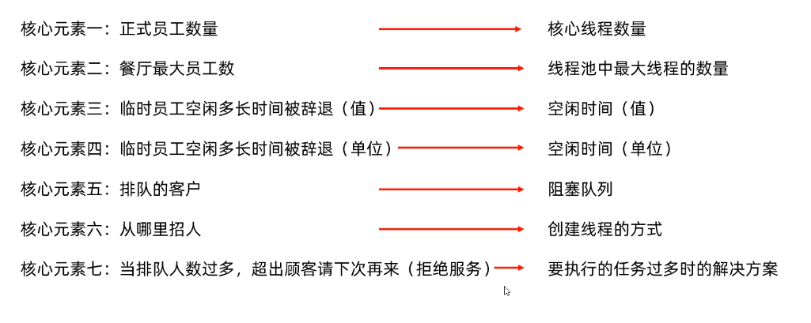
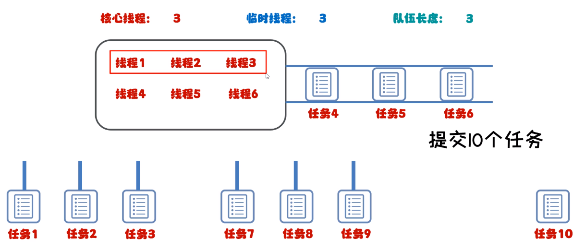

# Java-多线程

## 一、线程池（ThreadPool）

### （一）核心原理

1. 创建一个池子，池子中是空的
2. 提交任务时，池子会创建线程对象，任务执行完毕时，线程会归还给池子
3. 下回再提交任务时，不需要再创建新的线程，直接复用已有线程即可
4. 但是如果提交任务时，池子中有空闲线程，也无法创建新的线程，任务就会排队等待

### （二）代码实现

* Executors：线程池的工具类通过调用方法返回不同类型的线程池对象
* 相关方法

| 方法名称                                                        | 说明                     |
| --------------------------------------------------------------- | ------------------------ |
| public static ExecutorService newCachedThreadPool()             | 创建一个没有上限的线程池 |
| punlic static ExecutorService newFixedThreadPool(int nThrreads) | 创建有上限的线程池       |

#### 实现步骤

1. 创建线程池
2. 提交任务
3. 所有的任务全部执行完毕，关闭线程池（现实应用中，一般不关闭，如服务器24小时运行）

##### 1.实现没有上限的线程池（newCachedThreadPool()）

```java
//创建实现类实现接口Runnable
public class MyRunnable implements Runnable{
    @Override
    public void run() {
        //...
    }
}
```

```java
public class MyThreadPool_Demo {
    public static void main(String[] args) throws InterruptedException {
        //1.获取无限线程池对象newCachedThreadPool()
        ExecutorService pool1 = Executors.newCachedThreadPool();

        //2.提交任务，submit方法中传入实现类对象
        pool1.submit(new MyRunnable());//1
        pool1.submit(new MyRunnable());//2
        pool1.submit(new MyRunnable());//3
        pool1.submit(new MyRunnable());//4
        pool1.submit(new MyRunnable());//5
  

        //3.使用shutdown方法，销毁线程池
        pool1.shutdown();
    }
}
```

* 执行结果：5条线程执行任务

##### 2.实现有上限的线程池（newFixedThreadPool(int nThrreads)）

```java
public class MyThreadPool_Demo {
    public static void main(String[] args) throws InterruptedException {
        //1.获取有限线程池对象newFixedThreadPool(int nThrreads)
        ExecutorService pool1 = Executors.newFixedThreadPool();

        //2.提交任务，submit方法中传入实现类对象
        pool1.submit(new MyRunnable());//1
        pool1.submit(new MyRunnable());//2
        pool1.submit(new MyRunnable());//3
        pool1.submit(new MyRunnable());//4
        pool1.submit(new MyRunnable());//5
  

        //3.使用shutdown方法，销毁线程池
        pool1.shutdown();
    }
}
```

* 执行结果：只有3条线程执行任务

## 二、自定义线程池

* 类名（构造方法名）：ThreadPoolExecutor

### （一）核心原理 #1

#### 1.构造方法各参数意义

* ThreadPoolExecutor(int 核心线程数量, int 线程池中最大线程的数量, long 空闲时间（值）, TimeUnit 空闲时间（单位）, BlockingQuene\<Runnable> 阻塞队列, ThreadFactory 创建线程的方式, RejectExecutionHandler 要执行的任务过多时的解决方案)



#### 2.注意细节

* 何时创建临时线程：常驻核心线程都被占用，且任务阻塞队列满了，才会创建临时线程
* 先提交的任务不一定先执行，例：先提交的任务进入阻塞队列，队列满了以后，后提交的任务会直接提交给创建的临时线程执行，结果就是后提交的任务可能【早于】队列中先提交的任务执行，如下图所示



#### 3.代码实现

```java
/**
         *参数一：核心线程数量                    不能小于0
         * 参数二：线程池中最大线程的数量           不能小于0 最大数量 >= 核心线程数量
         * 参数三：空闲时间（值）                  不能小于0
         * 参数四：空闲时间（单位）                 用TimeUnit指定
         * 参数五：阻塞队列                        不能为null
         * 参数六：创建线程的方式                   不能为null
         * 参数七：要执行的任务过多时的解决方案        不能为null
         */
ThreadPoolExecutor pool = new ThreadPoolExecutor(
                3,
                6,
                60,
                TimeUnit.SECONDS,
                new ArrayBlockingQueue<>(3),
                Executors.defaultThreadFactory(),
                new ThreadPoolExecutor.AbortPolicy()
        );
```

### （二）任务的拒绝策略

* 即要执行的任务过多时的解决方案，方法的最后一个参数
* 相关方法（一般使用默认策略，另外三个策略了解即可）

| 任务拒绝策略                        | 说明                                                     |
| ----------------------------------- | -------------------------------------------------------- |
| ThreadPoolExecutor.AbortPolicy      | 【默认策略】丢弃任务并抛出RejectedExecutionException异常 |
| ThreadPoolExecutor.DiscardPolicy    | 丢弃任务，但是不抛出异常（不推荐）                       |
| ThreadPoolExecutor.DiscardOldPolicy | 抛弃队列中等待最久的任务 然后把当前任务加入队列中        |
| ThreadPoolExecutor.CallerRunsPolicy | 调用任务的run()方法绕过线程池直接执行                    |
