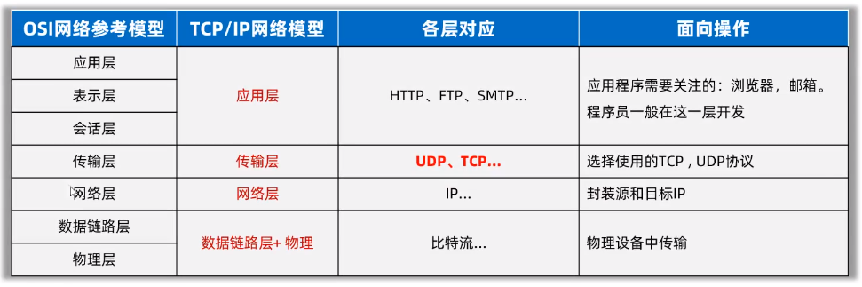
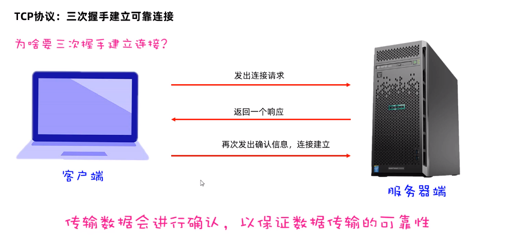
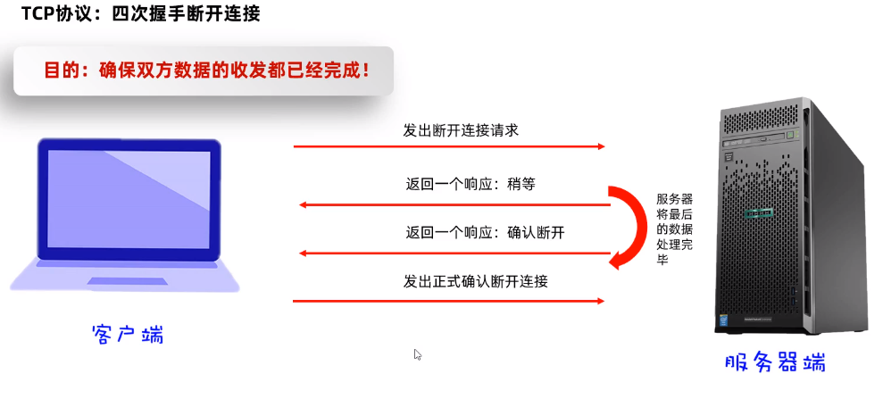

# Java提供的网络编程方案

* **java.net.包下提供了网络编程的解决方案**

## 一、基本的通信架构

* 基本的通信架构有两种形式：C/S架构（Client客户端/Server服务端）、BS架构（Browser浏览器/Server服务端）

### C/S

* Client客户端：需要程序员开发，用户需要安装客户端
* Server服务端：需要程序员开发实现

### B/S

* Browser：不需要程序员开发实现，用户需要安装浏览器
* Server服务端：需要程序员开发实现

无论是CS架构还是BS架构，都必须依赖【网络编程】

## 二、网络通信的关键三要素

IP地址、端口号、通信协议

### （一）IP地址

* IP（Internet Protocol）：全称“互联网协议地址”，是分配给上网设备的唯一标志
* IP地址的两种形式：IPv4（32位地址：4段8位）、IPv6（128位地址：8段16位）
* IP域名：如百度域名www.baidu.com，与IP地址相互映射

#### 1.公网IP、内网IP

* 公网IP：是可以连接互联网的IP地址
* 内网IP：也叫局域网IP，只能组织机构内部使用。如192.168.开头的就是常见的局域网地址范围为192.168.0.0-192.168.255.255，专为组织机构内部使用

#### 2.特殊IP地址

* 127.0.0.1、localhost：本地回环地址，代表本机IP，只会寻找当前所在的主机

#### 3.常见IP命令

* ipcoonfig:查看本机IP地址
* ping IP地址：检查网络是否连通

#### 4.Java相关类：InetAddress

* 代表IP地址

| 名称                                             | 说明                                             |
| ------------------------------------------------ | ------------------------------------------------ |
| public static InetAddress getlocalHost()         | 获取本机IP，会以一个inetAddress对象返回          |
| public static InetAddress getByName(String host) | 根据IP地址或者域名，返回一个inetAddress对象      |
| public String getHostName()                      | 获取该IP地址对象对应的主机名                     |
| public String gethostAddress()                   | 获取该IP地址对象中的IP地址信息                   |
| public Boolean isReachable(int timeout)          | 在指定毫秒内，判断主机与该IP对应的主机是否能连通 |

### （二）端口号

* 标记正在计算机设备上运行的应用程序的，被规定为一个16位的二进制数，范围是0~65535

#### 1.端口分类

* 固定端口：0~1023：被预先定义的知名应用占用（如：HTTP占用80端口，FTP占用21端口）
* 注册端口：1024~49151，分配给用户进程或者某些应用程序
* 动态端口：49152~65535，之所以被称为动态端口，是因为它一般不固定分配给某种进程，而是动态分配

注意：我们自己开打的程序一般使用注册端口，且一个设备中两个运行中的程序的端口号不能一样，否则出错

### （三）通信协议

* 网络上通信的设备，事先规定的连接规则，以及传输数据的规则被称为网络通信协议
* OSI七层参考模型：全球网络互联标准
* TCP/IP模型：事实上采用的国际标准

#### 1.两种模型对比

#### 2.传输层的两个通信协议（UDP/TCP）

* UDP（User Datagram Protocol）：用户数据包协议；TCP（Transmission Control Protocol）：传输控制协议

##### （1）UDP协议

* 特点：无连接、不可靠通信、通信效率高
* 不事先建立连接，数据按照包发送，一包数据包含：自己的IP、程序端口，目的地IP、程序端口和数据（限制在64KB内）等
* 发送方不管对方是否在线，数据在中间丢失也不管，如果接收方收到数据也不返回确认，故是不可靠的
* 常见应用场景：语音通话、视频直播、网络游戏

##### （2）TCP协议

* 特点：面向连接、可靠通信、通信效率相对较低
* TCP的最终目的：要保证在不可靠的信道上实现可靠的传输
* TCP主要有三个步骤实现可靠传输：【三次握手】建立连接，传输数据进行确认，【四次挥手】断开连接
* 三次握手建立可靠连接：确定通信双方，收发消息都是正常无问题的（全双工）

* 四次挥手断开连接：确保双方数据的收发都已完成

* 常见应用场景：网页、文件下载、支付
