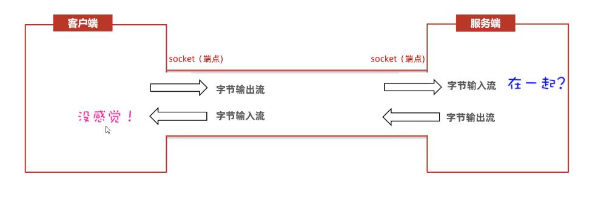

# Java TCP通信

* **特点：面向连接、可靠通信**
* **Java提供了一个java.net.Socket类来实现TCP通信**



## 一、Socket类

### （一）客户端开发

* 【客户端】程序就是通过java.net包下的【Socket类】来实现的

| 构造器                               | 说明                                                                           |
| ------------------------------------ | ------------------------------------------------------------------------------ |
| public Socket(String host, int port) | 根据指定的服务器IP、端口号请求与服务器建立连接，连接通过，就获得了客户端socket |

| 方法                                  | 说明               |
| ------------------------------------- | ------------------ |
| public OutputStream getOutputStream() | 获得字节输出流对象 |
| public InputStream getInputStream()   | 获得字节输入流对象 |

* 客户端实现步骤：

```java
 	//1.创建Socket对象，并同时请求与服务端程序的连接
        Socket socket = new Socket("127.0.0.1", 8888);

        //2.从socket通信管道中得到一个字节输出流，用来发数据给服务端
        OutputStream os = socket.getOutputStream();

        //3.把低级的字节输出流包装成数据输出流
        DataOutputStream dos = new DataOutputStream(os);

        //4.开始写数据
        dos.writeUTF("发送的数据");
        dos.close();
        socket.close();//释放连接资源
```

### （二）服务端开发

* 【服务端】时通过java.net包下的【ServerSocket类】来实现的

| 构造器                        | 说明                 |
| ----------------------------- | -------------------- |
| public ServerSocket(int port) | 为服务端程序注册端口 |

| 方法                   | 说明                                                                             |
| ---------------------- | -------------------------------------------------------------------------------- |
| public Socket accept() | 阻塞等待客户端的连接请求，一旦与某个客户端成功连接，则返回服务端这边的Socket对象 |
