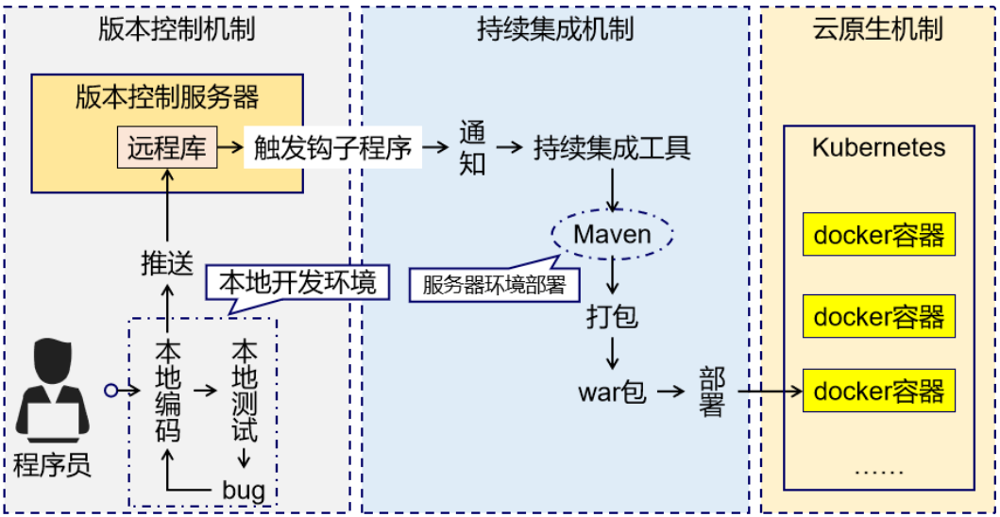
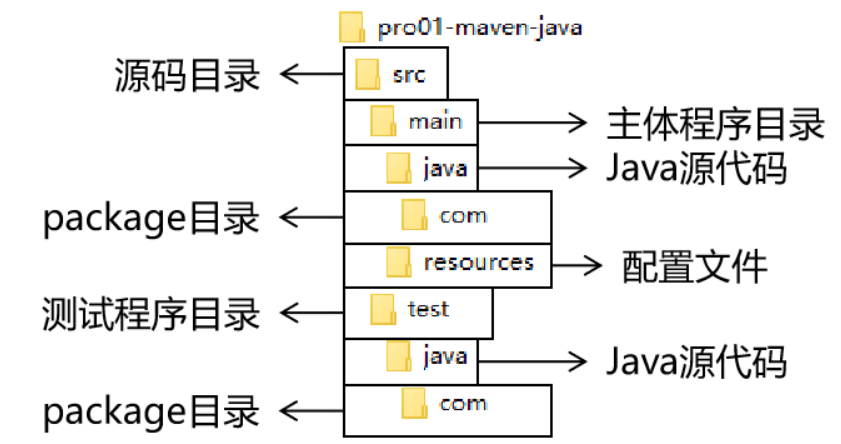
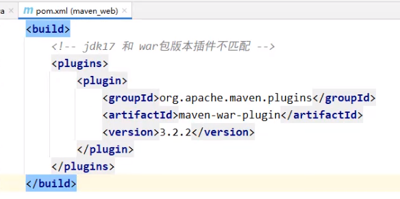
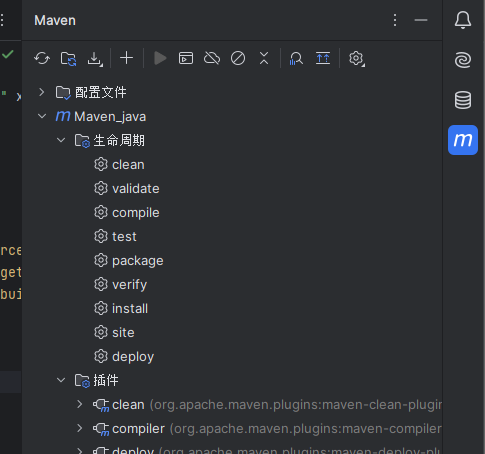
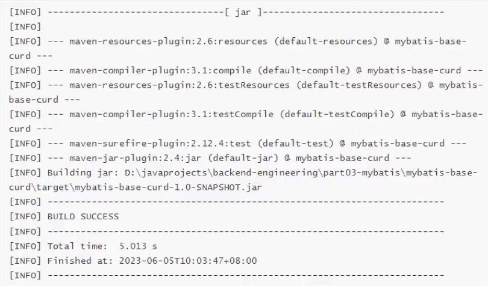
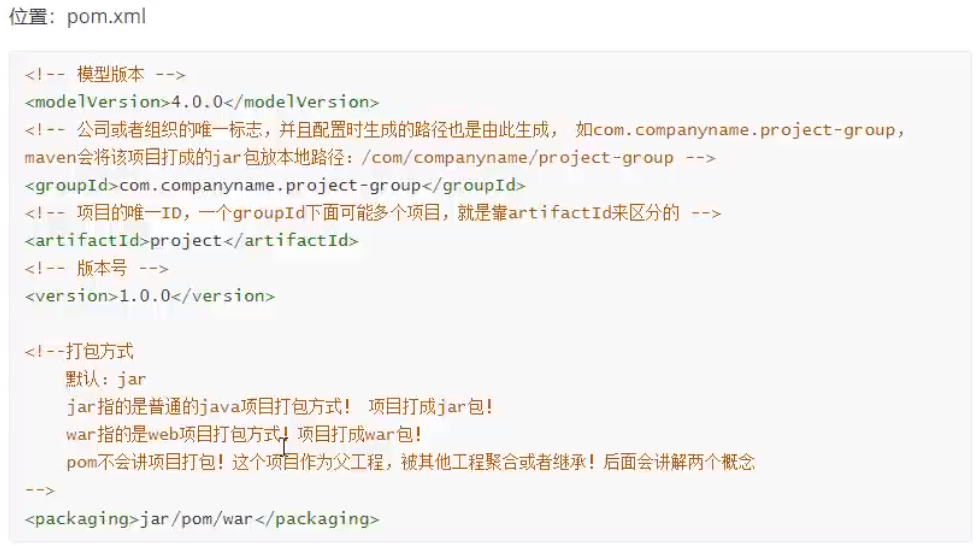

# （）Maven依赖管理、项目构建工具

## 一、什么是Maven?

Maven 是 Apache 软件基金会组织维护的一款专门为 Java 项目提供构建和依赖管理支持的工具。Maven是一个强大的构建工具，它提供一种标准化的项目结构，以帮助开发者更容易地管理项目的依赖、构建、测试和发布任务。

### （一）Maven 作为依赖管理工具

* 随着我们使用越来越多的框架，或者框架封装程度越来越高，项目中使用的jar包也越来越多。项目中，一个模块里面用到上百个jar包是非常正常的。jar包所属技术的官网通常是英文界面，网站的结构又不尽相同，甚至找到下载链接还发现需要通过特殊的工具下载。框架中使用的 jar 包，不仅数量庞大，而且彼此之间存在错综复杂的依赖关系。jar 包之间有可能产生冲突。进一步增加了我们在 jar 包使用过程中的难度。
* 使用 Maven 后，依赖对应的 jar 包能够自动下载，方便、快捷又规范。使用 Maven 则几乎不需要管理 jar 包彼此之间存在错综复杂的依赖关系，极个别的地方调整一下即可，极大的减轻了我们的工作量。

### （二）Maven 作为构建管理工具

* 脱离 IDE 环境仍需构建



### （三）构建

* Java 项目开发过程中，构建指的是使用『原材料生产产品』的过程。
  * 原材料
    * Java 源代码
    * 基于 HTML 的 Thymeleaf 文件
    * 图片
    * 配置文件
    * ……
  * 产品
    * 一个可以在服务器上运行的项目
* 构建过程包含的主要的环节：
  * 清理：删除上一次构建的结果，为下一次构建做好准备
  * 编译：Java 源程序编译成 *.class 字节码文件
  * 测试：运行提前准备好的测试程序
  * 报告：针对刚才测试的结果生成一个全面的信息
  * 打包
    * Java工程：jar包
    * Web工程：war包
  * 安装：把一个 Maven 工程经过打包操作生成的 jar 包或 war 包存入Maven的本地仓库
  * 部署
    * 部署 jar 包：把一个 jar 包部署到 Nexus 私服服务器上
    * 部署 war 包：借助相关 Maven 插件（例如 cargo），将 war 包部署到 Tomcat 服务器上

### （四）依赖

如果 A 工程里面用到了 B 工程的类、接口、配置文件等等这样的资源，那么我们就可以说 A 依赖 B。

* 依赖管理中要解决的具体问题：

  * jar 包的下载：使用 Maven 之后，jar 包会从规范的远程仓库下载到本地
  * jar 包之间的依赖：通过依赖的传递性自动完成
  * jar 包之间的冲突：通过对依赖的配置进行调整，让某些jar包不会被导入

  

## 二、基于IDEA创建Maven工程

Maven 核心概念：坐标

### （一）Maven工程的GAVP（即坐标）

maven工程相对之前的项目，多出一组gavp属性，gav需要我们在创建项目的时候指定，p有默认值

Maven中的GAVP是指DroupId、ArtifactId、Version、Package等四个属性的缩写，其中前三个是必要的，而Package属性为可选项。这四个属性主要为每个项目在maven仓库中做一个标识

#### 1、 向量说明

使用三个『向量』在『Maven的仓库』中**唯一的定位**到一个『jar』包。

* groupId：公司或组织的 id
* artifactId：一个项目或者是项目中的一个模块的 id(更偏向于项目中的一个模块或一个没有进行拆分的项目)
* version：版本号

#### 2、三个向量的取值方式

* groupId：公司或组织域名的倒序，通常也会加上项目名称(为了区别项目这一层)

  * 例如：com.atguigu.maven
* artifactId：模块的名称，将来作为 Maven 工程的工程名
* version：模块的版本号，根据自己的需要设定

  * 例如：SNAPSHOT 表示快照版本，正在迭代过程中，不稳定的版本
  * 例如：RELEASE 表示正式版本

#### 3、代码示例

* 在创建的工程的配置文件pom.xml中进行修改：

```xml
 <!-- 依赖信息配置 -->
<!-- dependencies复数标签：里面包含dependency单数标签 -->
<dependencies>
  <!-- dependency单数标签：配置一个具体的依赖 -->
  <dependency>
    <!-- 通过坐标来依赖其他jar包 -->
    <groupId>junit</groupId>
    <artifactId>junit</artifactId>
    <version>4.12</version>
  
    <!-- 依赖的范围 -->
    <scope>test</scope>
  </dependency>
</dependencies>

```

### （二）Maven工程结构



* 另外还有一个 target 目录专门存放构建操作输出的结果。

## 三、基于IDEA进行Maven工程构建

### （一）命令行方式构建

| 命令        | 描述                        |
| ----------- | --------------------------- |
| mvn compile | 编译项目，生成target文件    |
| mvn package | 打包项目，生成jar或war文件  |
| mvn clean   | 清理编译或打包后的项目结构  |
| mvn install | 打包后上传到maven本地仓库   |
| mvn depoly  | 只打包，上传到maven私服仓库 |
| mvn site    | 生成站点                    |
| mvn test    | 执行测试源码                |

* Tip：在pom.xml的 `<properties>`中加入以下参数防止命令行出现中文乱码

```xml
<!-- 解决文件拷贝时的编码 -->
<project.build.sourceEncoding>UTF-8</project.build.sourceEncoding>
<project.reporting.outputEncoding>UTF-8</project.reporting.outputEncoding>
<!-- 解决编译时中文乱码-->
<project.compiler.encoding>UTF-8</project.compiler.encoding>
```

#### 1、test测试

* 作用：测试test目录中的java类
* Tip：junit的test测试中，测试类名【必须】以Test（区分大小写）结尾，否则无法识别，类中的方法名建议以Test开头，代码示例：

```java
public class MavenTest {
    @Test
    public void TestAssert(){
        int a=10;
        int b=20;
        Assertions.assertEquals(a+b,30);
    }
}
```

#### 2、package打包

* 默认打包名称：项目工程名称-Maven工程版本
* 若maven版本与jdk版本不匹配，须在pom.xml中配置插件，如下图
  

#### 3、install安装

* 功能：将【本地】的工程打包成jar包或war包安装到【本地仓库】
* 打包（package）和安装（install）的区别：安装会把打包好的包安装到本地仓库，以便于其它工程可以按照其坐标找到此包的依赖

### （二）IDEA可视化构建

* 集成开发环境IDEA中有可视化构建界面
  

### （三）构建插件、命令、生命周期之间的关系*

* 前例的实操中，我们发现，当执行package命令时也会自动执行compile命令,这种行为就是因为构建生命周期产生的
  
* 构建生命周期可以理解成时【一组固定】构建命令的【有序集合】，执行周期最后的命令，会自动触发周期前的命令

#### 1、构建周期的作用：简化构建过程

* 例如：项目打包执行 mvn clean package 即可
* 主要的两个构建生命周期：
  * 清理周期：主要是对项目编译文件进行清理
    * 包含命令：clean
  * 默认周期：定义了真正构建时所需要执行的所有步骤，它是生命周期中最核心的部分
    * 包含命令：compile - test - package - install - depoly

#### 2、插件、命令、周期三者关系（了解）

* 周期 —> 包含若干命令 —> 包含若干插件
* 使用周期命令构建，简化构建过程
* 最终进行构建的是插件

## 四、基于IDEA进行Maven依赖管理

### （一）依赖管理概念

* Maven的依赖管理能够帮助开发者自动解决软件包依赖问题，使得开发人员能够轻松地将其他开发者开发的模块或者第三方框架集成到自己的应用程序或者模块中，避免出现版本冲突和依赖缺失问题
* 通过配置【pom.xml】文件，Maven能够自动解析项目的依赖关系，并通过Maven仓库自动下载和管理依赖，避免了手动下载和管理依赖的繁琐过程和可能出现的版本冲突问题
* 配置信息解读
  

### （二）依赖管理配置

#### 1、依赖管理和依赖添加

```xml
<dependencies>
  <!--引入具体的依赖包-->
  <dependency>
    <groupId>org.junit.jupiter</groupId>
    <artifactId>junit-jupiter-api</artifactId>
    <version>5.9.3</version>
    <!--依赖范围-->
    <scope>test</scope>
  </dependency>

</dependencies>
```

#### 2、依赖版本【统一】提取和维护*

```xml
<properties>
  <maven.compiler.source>21</maven.compiler.source>
  <maven.compiler.target>21</maven.compiler.target>
  <project.build.sourceEncoding>UTF-8</project.build.sourceEncoding>
  <!--定义版本-->
  <junit.version>5.9.3</junit.version>
</properties>

<dependency>
  <groupId>org.junit.jupiter</groupId>
  <artifactId>junit-jupiter-api</artifactId>
  <!--使用“${}”引用<properties>中定义的版本，实现统一版本管理-->
  <version>${junit.version}</version>
  <scope>test</scope>
</dependency>
```

#### 3、依赖范围*

通过设置坐标的依赖范围（scope），可以设置对应jar包作用范围：编译环境、测试环境、运行环境

| 依赖范围 | 描述                                                                                                                                                                                                                                                                                                                                                                  |
| -------- | --------------------------------------------------------------------------------------------------------------------------------------------------------------------------------------------------------------------------------------------------------------------------------------------------------------------------------------------------------------------- |
| compile  | 【编译依赖范围*】默认依赖范围，此依赖范围对 于编译、测试、运行三种classpath都有效，举个简单的例子，假如项目中有spring-core的依赖，那么spring-core不管是在编译，测试，还是运行都会被用到，因此spring-core必须是编译范围（构件默认的是编译范围，所以依赖范围是编译范围的无须显示指定）                                                                                  |
| test     | 【测试依赖范围*】顾名思义就是针对于测试的，使用此依赖范围的依赖，只对测试classpath有效，在编译主代码和项目运行时，都将无法使用该依赖，最典型的例子就是 Junit, 构件在测试时才需要，所以它的依赖范围是测试，因此它的依赖范围需要显示指定为 `<scope>`test `</scope>` ,当然不显示指定依赖范围也不会报错，但是该依赖会被加入到编译和运行的classpath中,造成不必要的浪费 |
| provided | 【已提供依赖范围*】使用该依赖范围的maven依赖，只对编译和测试的classpath有效，对运行的classpath无效，典型的例子就是servlet-api， 编译和测试该项目的时候需要该依赖，但是在运行时，web容器已经提供的该依赖，所以运行时就不再需要此依赖，如果不显示指定该依赖范围，并且容器依赖的版本和maven依赖的版本不一致的话，可能会引起版本冲突，造成不良影响。                      |
| runtime  | 【运行时依赖范围】使用该依赖范围的maven依赖，只对测试和运行的classpath有效，对编译的classpath无效，典型例子就是JDBC的驱动实现，项目主代码编译的时候只需要JDK提供的JDBC接口，只有在测试和运行的时候才需要实现上述接口的具体JDBC驱动。                                                                                                                                  |
| system   | 【系统依赖范围】该依赖与classpath的关系与 provided依赖范围完全一致，但是系统依赖范围必须通过配置systemPath元素来显示指定依赖文件的路径，此类依赖不是由maven仓库解析的，而且往往与本机系统绑定，可能造成构件的不可移植，因此一般不推荐使用，systemPath元素可以引用环境变量                                                                                             |
| import   | 【导入依赖范围】该依赖范围不会对三种classpath产生影响，该依赖范围只能与dependencyManagement元素配合使用，其功能为将目标pom文件中dependencyManagement的配置导入合并到当前pom的dependencyManagement中。有关dependencyManagement的功能请了解maven继承特性                                                                                                                |

### （三）Build构建配置

默认情况下，构建不需要额外配置，都有对应的默认配置，当然，我们也可以在pom.xml定制一些配置，来修改默认构建的行为和产物

例如：

1. 指定构建打包文件的名称，非默认名称
2. 构建打包时，指定包含文件格式和排除文件
3. 打包插件版本过低，配置更高版本的插件

构建配置是在pom.xml/build标签中指定

#### 1、自定义打包名称

```xml
<!--默认打包名称：artifactid+version.打包方式-->
<build>
  <finalName>自定义包名</finalName>
</build>
```

#### 2、指定打包文件

* 如果在java目录中添加java类，会自动打包编译到classes目录下；但是在java文件夹中添加xml文件，默认不会被打包
* 默认情况下，按照maven工程结构放置的文件会默认被编译和打包
* 除此之外、我们可以使用【resources标签】，指定要打包资源的文件夹要把哪些静态资源打包到classes根目录下
* 应用场景：mybatis中有时会将用于编写sql语句的映射文件和mapper接口都写在src/main/java下的某个包中，此时映射文件就不会被打包，如何解决，此时需要在\<build>标签下配置指定打包文件？

  ```xml
  <build>
    <!--设置要打包的资源位置-->
    <finalName>MavenWeb-1.0</finalName>
    <resources>
      <resource>
        <!--设置资源所在目录-->
        <directory>src/main/java</directory>
        <includes>
          <!--设置包含的资源类型-->
          <include>**/*.xml</include>
        </includes>
      </resource>
    </resources>
  </build>
  ```

#### 3、配置依赖插件

* dependencies标签下引入开发需要的jar包，我们可以在build/plugins/plugin标签引入插件
* 常用的插件：修改jdk版本、tomcat插件、mybatis分页插件、mybatis逆向工程插件等等

```xml
<build>
  <plugins>
    <!--java编译插件，配置jdk的编译版本-->
    <plugin>
      <groupId>org.apache.maven.plugins</groupId>
      <artifactId>maven-compiler-plugin</artifactId>
      <version>3.8.0</version>
      <configuration>
        <source>1.8</source>
        <target>1.8</target>
        <encoding>UTF-8</encoding>
      </configuration>
    </plugin>
    <!--tomcat插件-->
    <plugin>
      <groupId>org.apache.tomcat.maven</groupId>
      <artifactId>tomcat7-maven-plugin</artifactId>
      <version>2.2</version>
        <configuration>
          <port>8090</port>
          <path>/</path>
          <uriEncoding>UTF-8</uriEncoding>
          <server>tomcat7</server>
        </configuration>
    </plugin>
  </plugins>
</build>
```
