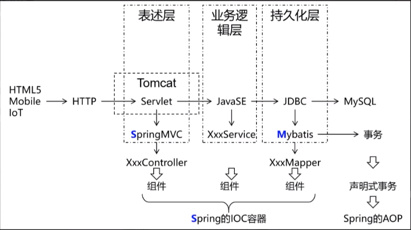
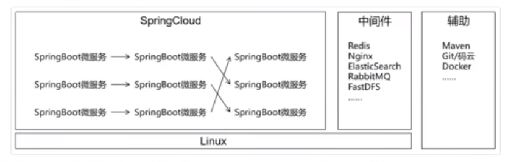
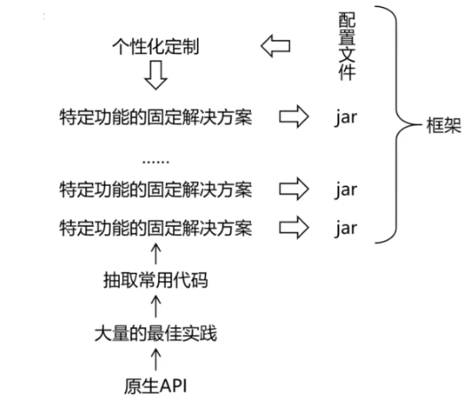

# SpringFramework概念

## 一、技术体系结构

### 1.1 总体技术体系

* 单一架构
  * 一个项目，一个工程，导出为一个war包，在一个Tomcat上运行。也叫all in one
  * 单一架构，项目主要应用技术框架为：Spring、SpringMVC、Mybatis（统称SSM）
  
    

* 分布式架构
  * 一个项目（对应IDEA中的一个project），拆分成很多个模块，每个模块是一个IDEA中的一个moudle。每一个工程都是运行在自己的Tomcat上。模块之间可以互相调用。每一个模块内部可以看成是一个单一架构的应用
  * 分布式架构，项目主要应用技术框架：SpringBoot（SSM），SpringCloud，中间件等

    

### 1.2 框架概念和理解

* 框架（Framework）是一个集成了基本结构、规范、设计模式、编程语言和程序库等基础组件的软件系统，它可以用来构建更高级别的应用程序。
* 使用框架的优点
  * 提高开发效率：框架提供预先设计好的组件工具，帮助快速开发
  * 降低开发成本：提供标准化的编程语言、数据操作代码片段，减少重复写代码、重复开发
  * 提高应用程序的稳定性：框架是经过长时间开发测试、通过了验证的成熟产品，更加稳定
  * 提供标准化的解决方案：针对某些特定应用场景，提供标准化的解决方案，在共同的标准下方便了多人开发的沟通与协作
* 框架的缺点
  * 学习成本高：框架具有特定的语言和编程范式，其背后的架构、模式和逻辑学习内容多，学习耗时长
  * 可能存在局限性：特定的应用需求可能超出框架范围
  * 版本变更与兼容性问题：框架版本的迭代通常导致代码库大规模变更，进而影响兼容性
  * 架构风险：框架涉及较多抽象概念，开发者若没有足够的理解，可能导致出现设计缺陷
* 框架总结理解：框架=jar包+配置文件

  

## 二、SpringFramework介绍

### 2.1 Spring和SpringFramework介绍

* 广义的Spring：Spring技术栈（全家桶）
  * 广义上泛指以SpringFramework为基础的Spring技术栈：Spring Framework、SpringMVC、SpringBoot、Spring Cloud等，**其中Spring Framework是其它子项目的基础**
* 狭义的Spring：Spring Framework（基础框架）
  * 狭义上特指Spring Framework，即Spring框架：Spring Framework是由SpringSource公司开发的开源应用程序框架，它提供了很多功能：如依赖注入（DI）、面向切面编程（AOP）、声明事物管理（TX）等，被广泛应用于Java企业开发领域

### 2.2 SpringFramework主要功能模块

|功能模块|功能介绍|
|-|-|
|Core Container|核心容器，在Spring环境下使用任何功能都必须基于IOC容器|
|AOP&Aspects|面向切面编程|
|TX|声明式事务管理|
|SpringMVC|提供了面向Web应用程序的集成功能|

Tip：从SpringFramework 6.0.6版本开始，需要JDK 17+版本支持

### 2.3 SpringFramework主要优势

* 丰富的生态系统：拥有许多模块和库，可以帮助开发者快速构建
* 模块化的设计：框架组件之间的松散耦合、模块化设计，使得其具有良好的扩展性和维护性
* 简化Java开发：提供各种开发工具和API，降低开发复杂度和学习成本
* 不断创新和发展：SpringFramework开发团队不断创新发展，保持与最新技术接轨

## 三、Spring IoC容器核心概念

* IoC的概念：IOC 全称为 Inversion of Control，翻译为 “控制反转”，它还有一个别名为 DI（Dependency Injection），即依赖注入（在Spring框架负责创建Bean对象时，动态的将依赖对象注入到Bean组件）
* 传统的Java se是通过new来创建一个对象，是程序主动创建依赖对象。IOC是指，利用反射的原理将创建对象的权利交给Spring容器（也就是“反转”了控制权），spring在运行的时候根据配置文件来动态的创建对象和维护对象之间的关系，实现了松耦合的思想（实现方式：配置文件，注解）

### 3.1 组件和组件管理概念

#### 3.1.1 什么是组件？
  
* 组件就是【可以复用】的java对象
* 组件一定是对象，对象不一定是组件，如果一些对象不需要复用就不是组件

  

#### 3.1.2 对“组件管理”的期待

* 自动创建组件对象
* 自动保存组件对象
* 自动组装
* 自动管理事物
* 自动整合其它框架
* ...

#### 3.1.3 Spring充当组件管理角色（IoC）

* 组件可以完全交给Spring框架进行管理，Spring框架替代了程序员原有的new对象和对象属性赋值工作等
* Spring具体的组件管理动作包括：
  * 组件对象实例化
  * 组件属性赋值
  * 组件对象之间引用
  * 组件对象存活周期管理
  * ...
* 我们只需要编写元数据（配置文件）告知Spring管理哪些类组件和它们的关系即可

综上所述，Spring充当一个容器，创建、管理、存储组件，减少了编写代码的压力

#### 3.1.4 组件交给Spring管理的优势

* 降低了组件之间的耦合性：虚弱了组件之间的依赖关系，减少了程序组件之间的耦合性
* 提高了代码的可重用性和可维护性：IoC容器统一管理组件的实例化过程、依赖关系，使代码更易于维护
* 方便配置管理：IoC容器通过XML文件或者注解，可以轻松配置、操作组件
* **Spring管理的对象（组件），才可以使用Spring框架其它功能（AOP，声明事物管理等）**

## 四、Spring AOP面向切面编程

### 4.1 AOP简介

* 在了解AOP之前首先要引入oop的概念，oop也就是我们熟知的面向对象程序设计(Object Oriented Programming)，oop关注的是将功能划分为模块，比如我们熟悉的三层架构——表现层、业务层、持久层，然后针对模块进行进一步的开发。

    

* 而AOP更加侧重于“抽取”的思想。抽取一些高频重用的代码块等，有一种“切开”的意思
  * AOP（Aspect Oritented Programing）面向切面编程，一种编程范式，隶属于软工范畴，指导开发者如何组织程序结构
  * AOP弥补了OOP的不足，基于OOP基础之上进行横向开发
    * OOP规定程序开发以类为主体模型，一切围绕对象进行，完成某个任务先构建模型
    * AOP程序开发主要关注基于OOP开发中的共性功能，一切围绕共性功能进行，完成某个任务先构建可能遇到的所有共性功能（当所有功能开发出来也就没有共性与非共性之分）
* 使用AOP的优势很多————代码可重用性高，编码更简洁、代码维护更高效、业务扩展更便捷等

### 4.2 AOP核心概念

    

1. 连接点：AOP将所有的方法都视为**连接点**，不管是接口里面的抽象方法，还是实现类里面的重写方法，都是连接点
2. 切入点：AOP将可能被【抽取共性功能】的**方法**称为**切入点**。切入点是连接点的子集
3. 通知：AOP将抽取出来的共性功能称为通知。通知类型：以通知在上下文中的具体位置作为划分。
4. 切面：ASP将切入点和通知（也就是被抽取的方法，和抽取出来的共性功能）之间的关系称为切面，切面描述了两者之间的关系。比如说，通知在切入点的上下文关系如何，这样才能保证将通知拼接回切入点之后能让程序正常运行

    

5. 目标对象：在把切入点的通知抽取完成之后剩下的部分（就像是残缺的方法），而一个方法必须要作为一个类的一部分参与整个项目，而这个类的调用需要一个实例化对象，这个对象就是所谓的目标对象
6. 织入：目标对象单打独斗是绝对不能运行的，我们需要将之前从切入点抽取的通知按照切面规定的关系还原回去，这样才是具有完整运行能力的方法。这个还原回去的过程，AOP称为织入
7. 代理：织入完成后，我们又重新获得了一个完整的方法；类似的，这个方法也要作为一个类的一部分参与项目的构建，而这个类是通过“5、目标对象”所在的类，变化过来的。这个变换的过程，称为代理。
8. 引入：通过代理我们得到了一个新的类，这个类具有目标对象所在类的一切属性、方法。同时，这个新的类，可以像打补丁一样，自己重新定义一些属性和方法（可以在不修改原有代码的基础上完成新增功能，这是非常重要的应用）

* 总结
    

### 4.3 AOP开发过程

    
